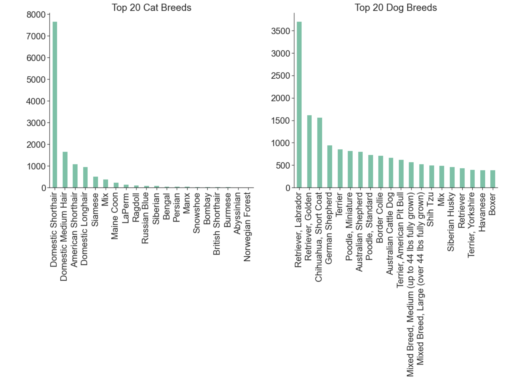
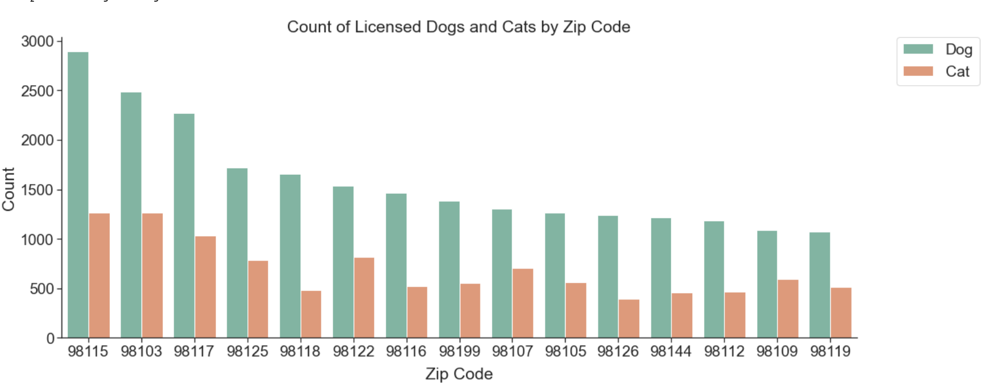
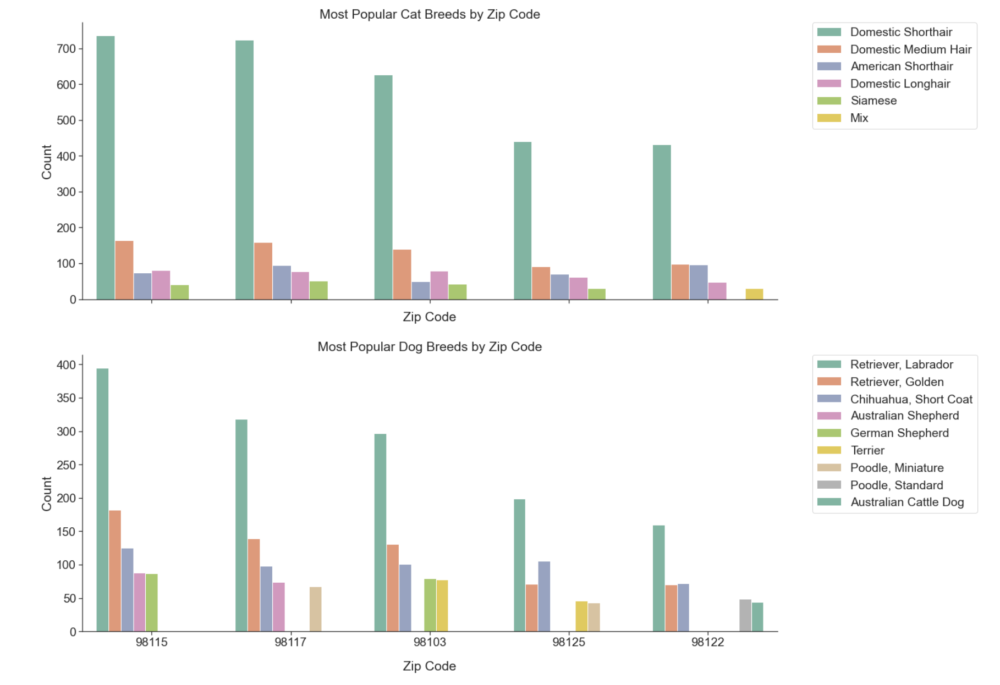
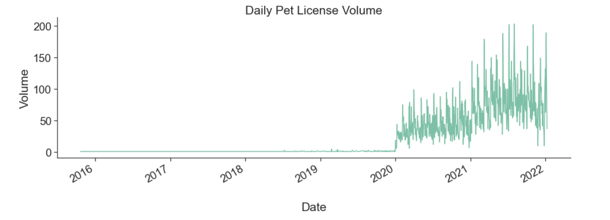
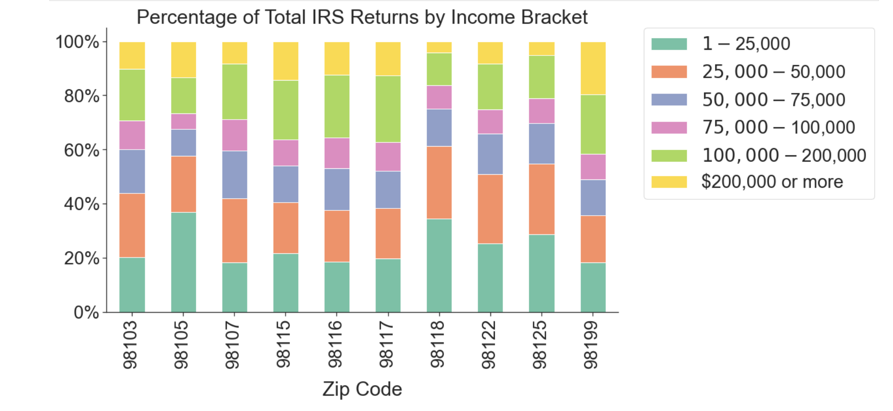
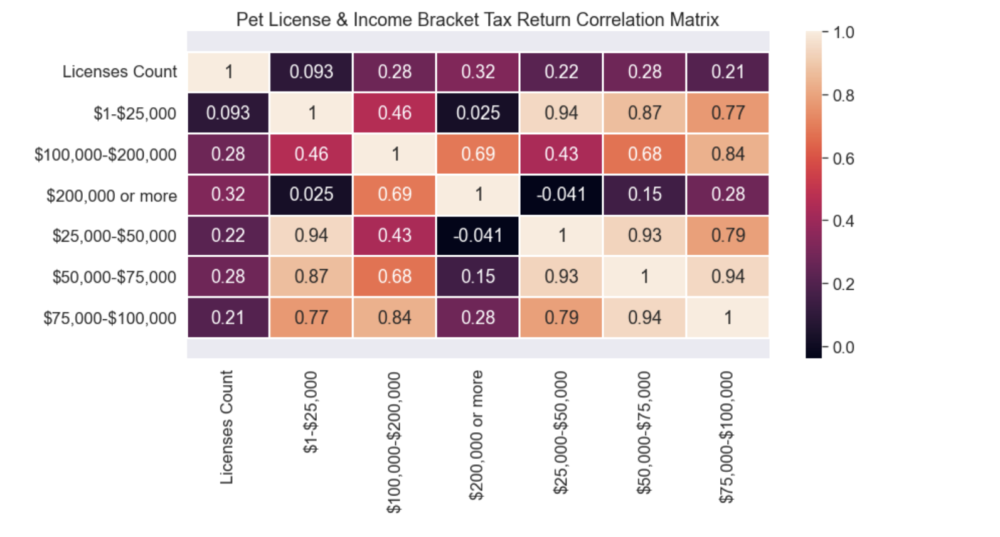

# Project 1
## Seattle Pet Licensing Trend and its correlation with Income 
### Project At A Glance
- Link to code: [here](https://github.com/NhiDang1001/pet_licensing_seattle-Python-/blob/master/seattle_pet.ipynb)
- Project tools: Python
- Visualizations: matplotlib
- Analyze and investigate the pet license database to inform Seattleites on pet ownership trends and explore the opportunity to adopt unlicensed pets from animal shelters
- Analyze over 67,000 records and create visualizations using matplotlib and seaborn’s heatmap function to discover 5 animals adoption trends in Seattle.
-	Conduct correlation matrix to see how the number of licensed pets correlates to income/ tax returns/ affluence by zip codes throughout the city; forecast the future adoption trends using Excel time series decomposition.

## Dependencies
`Python3`

`matplotlib.pyplot`

`numpy`

`pandas`

`seaborn`

## Exploratory Data Analysis
### Top 20 Common Pet Breeds
Plot the top 20 most frequently appearing breeds of dogs and cats seperately

Functions:
`groupby`
`rank()`

**From plot:** 
- Top three dog breeds are Labrador and Golden Retrievers and Short Coat Chihuahuas
- Top three cat breeds are the American Shorthair, Siamese, and the LaPerm. 

**Analysis:** 

Dog breeds also have a more even distribution while cat breeds are heavily skewed towards the domestic breeds, particularly the short hair variety. 

### Overall Ratio Across Zip Code
Plot the top 15 zip codes by toal number of dogs and cats

**From plot:** 
- Only three zip codes, 98115, 98103, and 98117 have more then 3,000 licensed pets.
- 2:1 ratio in the number of cats licensed compared to dogs

### Popular Dog and Cat Breeds By Zip Code
Plot the top five most frequently occurring dog and cat breeds within the zip codes with the most licensed pets.

**From plot:** 

Cat:
- After the removal of the domestic cat breeds, we see there is a relatively even distribution of several of the most popular breeds, including the Siamese, American Shorthair, LaPerm, and the Maine Coon. 
- The frequency of breeds is also somewhat consistent across zip codes, with Siamese and American Shorthairs being the most popular, followed by LaPerms and Maine Coons

Dog:
- The Short Hair Chihuahua is the most popular dog breed after the exclusion of Labrador and golden retrievers.
- Good notice: Miniature Poodles only appear in the 98115 and 98117 zip codes, as well as Beagles only showing up in the 98103 zip code.

### Time Series Trend of Issued Pet Licenses
Plot the number of licenses issued by day for all the days included in the dataset - Investigate how the volume of issued pet licenses has changed over time

Functions:
`to_datetime`

**From plot:** 
- Very little to no pet licenses being issued from the beginning of 2000 up until about mid-2013 when some noticeable volume began to emerge.
- From near the end of 2014 and after, the number of issued pet licenses balloons to over a hundred or more each day.

### Correlation Between the Number of Tax Returns Received by Different Ranges of Income and the Number of Pets Licensed Through The City

Functions:
`corr()`
`seaborn`
`merge()`

First, plot Percentage of Total IRS Returns by Income Bracket

**From plot:** 
- The majority of tax returns are from those making approximately $75,000 or less
- This majority is even higher in some zip codes, such as 98118 and 98105, reaching nearly 60% of IRS filers
- The 98199 zip code appears to be the most affluent based on data available according to the proportion of tax returns made by registrants with over $100,000 in income.
- Earlier, we saw the 98115, 98117, and 98103 zip codes have the most licensed pets. Based on the tax return data, these zip codes appear to be more affluent than others

**Analysis:** 
- There is a high correlation between the number of licensed pets and the affluence of the respective neighborhood

Second, construct a Correlation mMtrix to see how the number of licensed pets correlates to the number of tax returns by various income brackets

**From plot:** 
- The income brackets with the highest correlations to pets licensed are in the $25,000 to $75,000 range (close to 1), while the larger income brackets, $100,000 to more than $200,000, are slightly lower
- The correlation between the number of licensed pets and the distribution of wealth in a particular area according to the volume of tax returns for various income brackets could be considered strong given the social context of the data

### Links to Other Projects
1. [Seattle Pet Licensing](https://github.com/NhiDang1001/pet_licensing_seattle-Python-.git)
2. [YouTube APIs Analysis (Ali Abdaal channel)](https://github.com/NhiDang1001/YouTube-APIs-Analysis.git)
3. [Climate Change Analysis](https://github.com/NhiDang1001/Climate_Change_Analysis.git)

### Background
Hi! I'm Nhi Dang. I've grown a love for data analytics over the years. I took several data related coursework such as Data Science Statistics, Big Data Analytics, Probability & Discrete Mathematics at the University of Washington - Seattle, one of the top-ranked universities globally. I spend most of my freetime on learning Data Analytics and working on my own projects. The project I'm most proud of is the Seattle Pet Licensing. As a pet lover, I love working with Pet dataset. I've been working over and over again with this Seattle Pet Licensing Dataset, using MySQL, R (ggplot2), and Python(matplotlib). 

Now I focus on analysing whatever datasets come my way, automating my life wherer I can and conducting analysis on topics that interest me!

### Certification & Professional Skills
• Certifications: Google Data Analytics Professional Certificate, Python Data Analysis LinkedIn Certificate

• Technical Skills: Python, MySQL, Java, Google BigQuery, R, Tableau, Google SEO

• Data Visualization Libraries: Matplotlib, ggplot2

• Environment: JupyterLab, Jupyter Notebook

• Data Science & Miscellaneous Technologies: A/B Testing, Data Science pipeline (cleansing, wrangling, visualization, modeling, interpretation), Hypothesis testing, Git

### Contact Me
Professional Email: nhingocvandang@gmail.com

Linkedln: https://www.linkedin.com/in/nhi-dang-1001/
